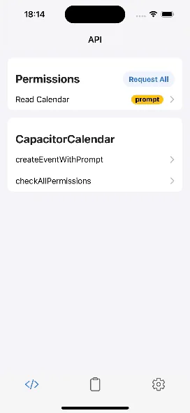
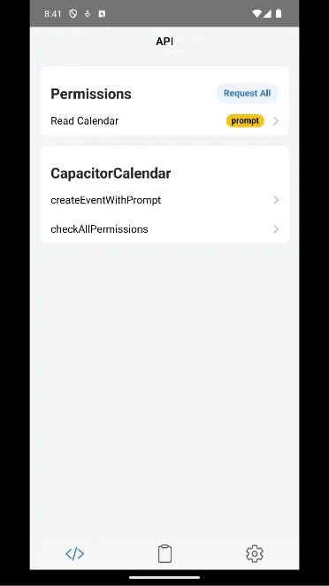

# @capgo/capacitor-calendar

<a href="https://capgo.app/">
  
</a>

<div align="center">
  <h2>
    <a href="https://capgo.app/?ref=plugin_calendar">Get Instant updates for your App with Capgo</a>
  </h2>
  <h2>
    <a href="https://capgo.app/consulting/?ref=plugin_calendar">Missing a feature? We'll build the plugin for you</a>
  </h2>
</div>

[](https://www.npmjs.com/package/@capgo/capacitor-calendar)
[](https://www.npmjs.com/package/@capgo/capacitor-calendar)
[](LICENSE)
[](https://capacitorjs.com/)

Native calendar and reminders access for Capacitor apps. Use it to request calendar permissions, create and edit events, open the system calendar UI, list calendars and events, and manage Reminders on iOS.

This package is a Capgo-maintained version of the calendar plugin originally built by [Ehsan Barooni](https://github.com/ebarooni/capacitor-calendar), ported to the Capgo Capacitor plugin template and Capacitor 8.

## Table of Contents

- [Installation](#installation)
- [Demo](#demo)
- [Setup](#setup)
- [Quick Start](#quick-start)
- [Common Recipes](#common-recipes)
- [Platform Support](#platform-support)
- [Compatibility](#compatibility)
- [Documentation](#documentation)
- [Changelog](#changelog)
- [API](#api)
- [License and Attribution](#license-and-attribution)

## Installation

```bash
npm install @capgo/capacitor-calendar
npx cap sync
```

## Demo

|                                                     iOS                                                     |                                                       Android                                                       |
| :---------------------------------------------------------------------------------------------------------: | :-----------------------------------------------------------------------------------------------------------------: |
|                |                |

## Setup

This plugin uses native calendar APIs, so each platform needs permission configuration before you request access at runtime.

Official platform references:

- [iOS: Migrating to the latest Calendar access levels](https://developer.apple.com/documentation/technotes/tn3152-migrating-to-the-latest-calendar-access-levels)
- [Android: Calendar Provider user permissions](https://developer.android.com/identity/providers/calendar-provider#manifest)

### iOS

Add the usage descriptions your app needs to `ios/App/App/Info.plist`. iOS 17 and newer distinguish between write-only and full calendar access.

```xml
<key>NSCalendarsUsageDescription</key>
<string>This app needs calendar access.</string>
<key>NSCalendarsWriteOnlyAccessUsageDescription</key>
<string>This app needs permission to add calendar events.</string>
<key>NSCalendarsFullAccessUsageDescription</key>
<string>This app needs permission to read and manage calendar events.</string>
<key>NSRemindersUsageDescription</key>
<string>This app needs reminders access.</string>
<key>NSRemindersFullAccessUsageDescription</key>
<string>This app needs permission to read and manage reminders.</string>
```

Only include the keys that match the APIs your app calls. For example, an app that only creates calendar events with write-only access does not need the Reminders keys.

### Android

Add the permissions your app needs to `android/app/src/main/AndroidManifest.xml`:

```xml
<uses-permission android:name="android.permission.READ_CALENDAR" />
<uses-permission android:name="android.permission.WRITE_CALENDAR" />
```

Then request the matching permission at runtime before reading or writing calendar data.

## Quick Start

```typescript
import { CapacitorCalendar } from '@capgo/capacitor-calendar';

const permission = await CapacitorCalendar.requestFullCalendarAccess();

if (permission.result !== 'granted') {
  throw new Error('Calendar permission was not granted');
}

const startDate = Date.now() + 60 * 60 * 1000;
const endDate = startDate + 60 * 60 * 1000;

const { id } = await CapacitorCalendar.createEvent({
  title: 'Product review',
  location: 'Capgo',
  startDate,
  endDate,
  description: 'Created with @capgo/capacitor-calendar',
});

console.log('Created event', id);
```

Dates are Unix timestamps in milliseconds.

## Common Recipes

### Open the native event editor

```typescript
await CapacitorCalendar.createEventWithPrompt({
  title: 'Planning session',
  location: 'Office',
  startDate: Date.now() + 24 * 60 * 60 * 1000,
  endDate: Date.now() + 25 * 60 * 60 * 1000,
});
```

On Android, `createEventWithPrompt` and `modifyEventWithPrompt` always return `null`. List events afterward if you need to find the created event ID.

### List upcoming events

```typescript
const now = Date.now();
const oneWeekFromNow = now + 7 * 24 * 60 * 60 * 1000;

const { result: events } = await CapacitorCalendar.listEventsInRange({
  from: now,
  to: oneWeekFromNow,
});
```

### Choose a calendar

```typescript
const { result: calendars } = await CapacitorCalendar.listCalendars();
const { result: defaultCalendar } = await CapacitorCalendar.getDefaultCalendar();

const calendarId = defaultCalendar?.id ?? calendars[0]?.id;
```

`selectCalendarsWithPrompt` is available on iOS when you want to show the system calendar picker.

### Create an iOS reminder

```typescript
const permission = await CapacitorCalendar.requestFullRemindersAccess();

if (permission.result === 'granted') {
  await CapacitorCalendar.createReminder({
    title: 'Send launch notes',
    dueDate: Date.now() + 2 * 24 * 60 * 60 * 1000,
    notes: 'Created with @capgo/capacitor-calendar',
  });
}
```

Reminder APIs are iOS-only.

## Platform Support

| Feature                                       | iOS | Android | Web |
| --------------------------------------------- | --- | ------- | --- |
| Permission checks and requests                | Yes | Yes     | No  |
| Create, modify, delete, and list events       | Yes | Yes     | No  |
| Native event create, edit, and delete prompts | Yes | Yes     | No  |
| Open the Calendar app                         | Yes | Yes     | No  |
| List calendars and get the default calendar   | Yes | Yes     | No  |
| Calendar sources                              | Yes | No      | No  |
| System calendar picker                        | Yes | No      | No  |
| Create, modify, and delete calendars          | Yes | Yes     | No  |
| Reminder lists and reminder CRUD              | Yes | No      | No  |

The web implementation exists only as a Capacitor stub and rejects native-only calls.

## Compatibility

| Plugin version | Capacitor compatibility | Maintained |
| -------------- | ----------------------- | ---------- |
| v8.x.x         | v8.x.x                  | Yes        |

## Documentation

The generated API reference is below. The source type definitions are in [src/definitions.ts](src/definitions.ts), and the package homepage is [capgo.app/docs/plugins/calendar](https://capgo.app/docs/plugins/calendar/).

For compatibility with older code, `requestPermission(...)` and `requestAllPermissions()` are still available. New apps should prefer `requestWriteOnlyCalendarAccess()`, `requestReadOnlyCalendarAccess()`, `requestFullCalendarAccess()`, and `requestFullRemindersAccess()`.

## Changelog

See [CHANGELOG.md](CHANGELOG.md) for release notes.

## License and Attribution

This package is released under MPL-2.0. The original `@ebarooni/capacitor-calendar` project was released under MIT by Ehsan Barooni; see [THIRD_PARTY_NOTICES.md](THIRD_PARTY_NOTICES.md) for attribution.

## API

<docgen-index>

* [`checkPermission(...)`](#checkpermission)
* [`checkAllPermissions()`](#checkallpermissions)
* [`requestPermission(...)`](#requestpermission)
* [`requestAllPermissions()`](#requestallpermissions)
* [`requestWriteOnlyCalendarAccess()`](#requestwriteonlycalendaraccess)
* [`requestReadOnlyCalendarAccess()`](#requestreadonlycalendaraccess)
* [`requestFullCalendarAccess()`](#requestfullcalendaraccess)
* [`requestFullRemindersAccess()`](#requestfullremindersaccess)
* [`createEventWithPrompt(...)`](#createeventwithprompt)
* [`modifyEventWithPrompt(...)`](#modifyeventwithprompt)
* [`createEvent(...)`](#createevent)
* [`modifyEvent(...)`](#modifyevent)
* [`deleteEventsById(...)`](#deleteeventsbyid)
* [`deleteEvent(...)`](#deleteevent)
* [`deleteEventWithPrompt(...)`](#deleteeventwithprompt)
* [`listEventsInRange(...)`](#listeventsinrange)
* [`commit()`](#commit)
* [`selectCalendarsWithPrompt(...)`](#selectcalendarswithprompt)
* [`fetchAllCalendarSources()`](#fetchallcalendarsources)
* [`listCalendars()`](#listcalendars)
* [`getDefaultCalendar()`](#getdefaultcalendar)
* [`openCalendar(...)`](#opencalendar)
* [`createCalendar(...)`](#createcalendar)
* [`deleteCalendar(...)`](#deletecalendar)
* [`modifyCalendar(...)`](#modifycalendar)
* [`fetchAllRemindersSources()`](#fetchallreminderssources)
* [`openReminders()`](#openreminders)
* [`getDefaultRemindersList()`](#getdefaultreminderslist)
* [`getRemindersLists()`](#getreminderslists)
* [`createReminder(...)`](#createreminder)
* [`deleteRemindersById(...)`](#deleteremindersbyid)
* [`deleteReminder(...)`](#deletereminder)
* [`modifyReminder(...)`](#modifyreminder)
* [`getReminderById(...)`](#getreminderbyid)
* [`getRemindersFromLists(...)`](#getremindersfromlists)
* [`deleteReminderWithPrompt(...)`](#deletereminderwithprompt)
* [Interfaces](#interfaces)
* [Type Aliases](#type-aliases)
* [Enums](#enums)

</docgen-index>

<docgen-api>
<!--Update the source file JSDoc comments and rerun docgen to update the docs below-->

### checkPermission(...)

```typescript
checkPermission(options: { scope: CalendarPermissionScope; }) => Promise<{ result: PermissionState; }>
```

Retrieves the current permission state for a given scope.

| Param         | Type                                                                                    |
| ------------- | --------------------------------------------------------------------------------------- |
| **`options`** | <code>{ scope: <a href="#calendarpermissionscope">CalendarPermissionScope</a>; }</code> |

**Returns:** <code>Promise&lt;{ result: <a href="#permissionstate">PermissionState</a>; }&gt;</code>

**Since:** 0.1.0

--------------------


### checkAllPermissions()

```typescript
checkAllPermissions() => Promise<{ result: CheckAllPermissionsResult; }>
```

Retrieves the current state of all permissions.

**Returns:** <code>Promise&lt;{ result: <a href="#checkallpermissionsresult">CheckAllPermissionsResult</a>; }&gt;</code>

**Since:** 0.1.0

--------------------


### requestPermission(...)

```typescript
requestPermission(options: { scope: CalendarPermissionScope; }) => Promise<{ result: PermissionState; }>
```

Requests permission for a given scope.

| Param         | Type                                                                                    |
| ------------- | --------------------------------------------------------------------------------------- |
| **`options`** | <code>{ scope: <a href="#calendarpermissionscope">CalendarPermissionScope</a>; }</code> |

**Returns:** <code>Promise&lt;{ result: <a href="#permissionstate">PermissionState</a>; }&gt;</code>

**Since:** 0.1.0

--------------------


### requestAllPermissions()

```typescript
requestAllPermissions() => Promise<{ result: RequestAllPermissionsResult; }>
```

Requests permission for all calendar and reminder permissions.

**Returns:** <code>Promise&lt;{ result: <a href="#checkallpermissionsresult">CheckAllPermissionsResult</a>; }&gt;</code>

**Since:** 0.1.0

--------------------


### requestWriteOnlyCalendarAccess()

```typescript
requestWriteOnlyCalendarAccess() => Promise<{ result: PermissionState; }>
```

Requests write access to the calendar.

**Returns:** <code>Promise&lt;{ result: <a href="#permissionstate">PermissionState</a>; }&gt;</code>

**Since:** 5.4.0

--------------------


### requestReadOnlyCalendarAccess()

```typescript
requestReadOnlyCalendarAccess() => Promise<{ result: PermissionState; }>
```

Requests read access to the calendar.

**Returns:** <code>Promise&lt;{ result: <a href="#permissionstate">PermissionState</a>; }&gt;</code>

**Since:** 5.4.0

--------------------


### requestFullCalendarAccess()

```typescript
requestFullCalendarAccess() => Promise<{ result: PermissionState; }>
```

Requests read and write access to the calendar.

**Returns:** <code>Promise&lt;{ result: <a href="#permissionstate">PermissionState</a>; }&gt;</code>

**Since:** 5.4.0

--------------------


### requestFullRemindersAccess()

```typescript
requestFullRemindersAccess() => Promise<{ result: PermissionState; }>
```

Requests read and write access to reminders.

**Returns:** <code>Promise&lt;{ result: <a href="#permissionstate">PermissionState</a>; }&gt;</code>

**Since:** 5.4.0

--------------------


### createEventWithPrompt(...)

```typescript
createEventWithPrompt(options?: CreateEventWithPromptOptions | undefined) => Promise<{ id: string | null; }>
```

Opens the system calendar interface to create a new event.
On Android this always returns `null`; fetch events to find the newly created event ID.

| Param         | Type                                                                                  |
| ------------- | ------------------------------------------------------------------------------------- |
| **`options`** | <code><a href="#createeventwithpromptoptions">CreateEventWithPromptOptions</a></code> |

**Returns:** <code>Promise&lt;{ id: string | null; }&gt;</code>

**Since:** 0.1.0

--------------------


### modifyEventWithPrompt(...)

```typescript
modifyEventWithPrompt(options: ModifyEventWithPromptOptions) => Promise<{ result: EventEditAction | null; }>
```

Opens a system calendar interface to modify an event.
On Android this always returns `null`.

| Param         | Type                                                                                  |
| ------------- | ------------------------------------------------------------------------------------- |
| **`options`** | <code><a href="#modifyeventwithpromptoptions">ModifyEventWithPromptOptions</a></code> |

**Returns:** <code>Promise&lt;{ result: <a href="#eventeditaction">EventEditAction</a> | null; }&gt;</code>

**Since:** 6.6.0

--------------------


### createEvent(...)

```typescript
createEvent(options: CreateEventOptions) => Promise<{ id: string; }>
```

Creates an event in the calendar.

| Param         | Type                                                              |
| ------------- | ----------------------------------------------------------------- |
| **`options`** | <code><a href="#createeventoptions">CreateEventOptions</a></code> |

**Returns:** <code>Promise&lt;{ id: string; }&gt;</code>

**Since:** 0.4.0

--------------------


### modifyEvent(...)

```typescript
modifyEvent(options: ModifyEventOptions) => Promise<void>
```

Modifies an event.

| Param         | Type                                                              |
| ------------- | ----------------------------------------------------------------- |
| **`options`** | <code><a href="#modifyeventoptions">ModifyEventOptions</a></code> |

**Since:** 6.6.0

--------------------


### deleteEventsById(...)

```typescript
deleteEventsById(options: DeleteEventsByIdOptions) => Promise<{ result: DeleteEventsByIdResult; }>
```

Deletes multiple events.

| Param         | Type                                                                        |
| ------------- | --------------------------------------------------------------------------- |
| **`options`** | <code><a href="#deleteeventsbyidoptions">DeleteEventsByIdOptions</a></code> |

**Returns:** <code>Promise&lt;{ result: <a href="#deleteeventsbyidresult">DeleteEventsByIdResult</a>; }&gt;</code>

**Since:** 0.11.0

--------------------


### deleteEvent(...)

```typescript
deleteEvent(options: DeleteEventOptions) => Promise<void>
```

Deletes an event.

| Param         | Type                                                              |
| ------------- | ----------------------------------------------------------------- |
| **`options`** | <code><a href="#deleteeventoptions">DeleteEventOptions</a></code> |

**Since:** 7.1.0

--------------------


### deleteEventWithPrompt(...)

```typescript
deleteEventWithPrompt(options: DeleteEventWithPromptOptions) => Promise<{ deleted: boolean; }>
```

Opens a dialog to delete an event.

| Param         | Type                                                                                  |
| ------------- | ------------------------------------------------------------------------------------- |
| **`options`** | <code><a href="#deleteeventwithpromptoptions">DeleteEventWithPromptOptions</a></code> |

**Returns:** <code>Promise&lt;{ deleted: boolean; }&gt;</code>

**Since:** 7.1.0

--------------------


### listEventsInRange(...)

```typescript
listEventsInRange(options: ListEventsInRangeOptions) => Promise<{ result: CalendarEvent[]; }>
```

Retrieves events within a date range.

| Param         | Type                                                                          |
| ------------- | ----------------------------------------------------------------------------- |
| **`options`** | <code><a href="#listeventsinrangeoptions">ListEventsInRangeOptions</a></code> |

**Returns:** <code>Promise&lt;{ result: CalendarEvent[]; }&gt;</code>

**Since:** 0.10.0

--------------------


### commit()

```typescript
commit() => Promise<void>
```

Saves pending iOS calendar changes.

**Since:** 7.1.0

--------------------


### selectCalendarsWithPrompt(...)

```typescript
selectCalendarsWithPrompt(options?: SelectCalendarsWithPromptOptions | undefined) => Promise<{ result: Calendar[]; }>
```

Opens a system interface to choose one or multiple calendars.

| Param         | Type                                                                                          |
| ------------- | --------------------------------------------------------------------------------------------- |
| **`options`** | <code><a href="#selectcalendarswithpromptoptions">SelectCalendarsWithPromptOptions</a></code> |

**Returns:** <code>Promise&lt;{ result: Calendar[]; }&gt;</code>

**Since:** 0.2.0

--------------------


### fetchAllCalendarSources()

```typescript
fetchAllCalendarSources() => Promise<{ result: CalendarSource[]; }>
```

Retrieves a list of calendar sources.

**Returns:** <code>Promise&lt;{ result: CalendarSource[]; }&gt;</code>

**Since:** 6.6.0

--------------------


### listCalendars()

```typescript
listCalendars() => Promise<{ result: Calendar[]; }>
```

Retrieves all available calendars.

**Returns:** <code>Promise&lt;{ result: Calendar[]; }&gt;</code>

**Since:** 7.1.0

--------------------


### getDefaultCalendar()

```typescript
getDefaultCalendar() => Promise<{ result: Calendar | null; }>
```

Retrieves the default calendar.

**Returns:** <code>Promise&lt;{ result: <a href="#calendar">Calendar</a> | null; }&gt;</code>

**Since:** 0.3.0

--------------------


### openCalendar(...)

```typescript
openCalendar(options?: OpenCalendarOptions | undefined) => Promise<void>
```

Opens the calendar app.

| Param         | Type                                                                |
| ------------- | ------------------------------------------------------------------- |
| **`options`** | <code><a href="#opencalendaroptions">OpenCalendarOptions</a></code> |

**Since:** 7.1.0

--------------------


### createCalendar(...)

```typescript
createCalendar(options: CreateCalendarOptions) => Promise<{ id: string; }>
```

Creates a calendar.

| Param         | Type                                                                    |
| ------------- | ----------------------------------------------------------------------- |
| **`options`** | <code><a href="#createcalendaroptions">CreateCalendarOptions</a></code> |

**Returns:** <code>Promise&lt;{ id: string; }&gt;</code>

**Since:** 5.2.0

--------------------


### deleteCalendar(...)

```typescript
deleteCalendar(options: DeleteCalendarOptions) => Promise<void>
```

Deletes a calendar by ID.

| Param         | Type                                                                    |
| ------------- | ----------------------------------------------------------------------- |
| **`options`** | <code><a href="#deletecalendaroptions">DeleteCalendarOptions</a></code> |

**Since:** 5.2.0

--------------------


### modifyCalendar(...)

```typescript
modifyCalendar(options: ModifyCalendarOptions) => Promise<void>
```

Modifies a calendar.

| Param         | Type                                                                    |
| ------------- | ----------------------------------------------------------------------- |
| **`options`** | <code><a href="#modifycalendaroptions">ModifyCalendarOptions</a></code> |

**Since:** 7.2.0

--------------------


### fetchAllRemindersSources()

```typescript
fetchAllRemindersSources() => Promise<{ result: CalendarSource[]; }>
```

Retrieves a list of reminder sources.

**Returns:** <code>Promise&lt;{ result: CalendarSource[]; }&gt;</code>

**Since:** 6.6.0

--------------------


### openReminders()

```typescript
openReminders() => Promise<void>
```

Opens the reminders app.

**Since:** 7.1.0

--------------------


### getDefaultRemindersList()

```typescript
getDefaultRemindersList() => Promise<{ result: RemindersList | null; }>
```

Retrieves the default reminders list.

**Returns:** <code>Promise&lt;{ result: <a href="#calendar">Calendar</a> | null; }&gt;</code>

**Since:** 7.1.0

--------------------


### getRemindersLists()

```typescript
getRemindersLists() => Promise<{ result: RemindersList[]; }>
```

Retrieves all available reminders lists.

**Returns:** <code>Promise&lt;{ result: Calendar[]; }&gt;</code>

**Since:** 7.1.0

--------------------


### createReminder(...)

```typescript
createReminder(options: CreateReminderOptions) => Promise<{ id: string; }>
```

Creates a reminder.

| Param         | Type                                                                    |
| ------------- | ----------------------------------------------------------------------- |
| **`options`** | <code><a href="#createreminderoptions">CreateReminderOptions</a></code> |

**Returns:** <code>Promise&lt;{ id: string; }&gt;</code>

**Since:** 0.5.0

--------------------


### deleteRemindersById(...)

```typescript
deleteRemindersById(options: DeleteRemindersByIdOptions) => Promise<{ result: DeleteRemindersByIdResult; }>
```

Deletes multiple reminders.

| Param         | Type                                                                              |
| ------------- | --------------------------------------------------------------------------------- |
| **`options`** | <code><a href="#deleteremindersbyidoptions">DeleteRemindersByIdOptions</a></code> |

**Returns:** <code>Promise&lt;{ result: <a href="#deleteremindersbyidresult">DeleteRemindersByIdResult</a>; }&gt;</code>

**Since:** 5.3.0

--------------------


### deleteReminder(...)

```typescript
deleteReminder(options: DeleteReminderOptions) => Promise<void>
```

Deletes a reminder.

| Param         | Type                                                                    |
| ------------- | ----------------------------------------------------------------------- |
| **`options`** | <code><a href="#deletereminderoptions">DeleteReminderOptions</a></code> |

**Since:** 7.1.0

--------------------


### modifyReminder(...)

```typescript
modifyReminder(options: ModifyReminderOptions) => Promise<void>
```

Modifies a reminder.

| Param         | Type                                                                    |
| ------------- | ----------------------------------------------------------------------- |
| **`options`** | <code><a href="#modifyreminderoptions">ModifyReminderOptions</a></code> |

**Since:** 6.7.0

--------------------


### getReminderById(...)

```typescript
getReminderById(options: GetReminderByIdOptions) => Promise<{ result: Reminder | null; }>
```

Retrieves a reminder by ID.

| Param         | Type                                                                      |
| ------------- | ------------------------------------------------------------------------- |
| **`options`** | <code><a href="#getreminderbyidoptions">GetReminderByIdOptions</a></code> |

**Returns:** <code>Promise&lt;{ result: <a href="#reminder">Reminder</a> | null; }&gt;</code>

**Since:** 7.1.0

--------------------


### getRemindersFromLists(...)

```typescript
getRemindersFromLists(options: GetRemindersFromListsOptions) => Promise<{ result: Reminder[]; }>
```

Retrieves reminders from multiple lists.

| Param         | Type                                                                                  |
| ------------- | ------------------------------------------------------------------------------------- |
| **`options`** | <code><a href="#getremindersfromlistsoptions">GetRemindersFromListsOptions</a></code> |

**Returns:** <code>Promise&lt;{ result: Reminder[]; }&gt;</code>

**Since:** 5.3.0

--------------------


### deleteReminderWithPrompt(...)

```typescript
deleteReminderWithPrompt(options: DeleteReminderWithPromptOptions) => Promise<{ deleted: boolean; }>
```

Opens a dialog to delete a reminder.

| Param         | Type                                                                                        |
| ------------- | ------------------------------------------------------------------------------------------- |
| **`options`** | <code><a href="#deletereminderwithpromptoptions">DeleteReminderWithPromptOptions</a></code> |

**Returns:** <code>Promise&lt;{ deleted: boolean; }&gt;</code>

**Since:** 7.2.0

--------------------


### Interfaces


#### CreateEventWithPromptOptions

| Prop               | Type                                                                | Description                                                                                                                                                                                      | Since |
| ------------------ | ------------------------------------------------------------------- | ------------------------------------------------------------------------------------------------------------------------------------------------------------------------------------------------ | ----- |
| **`alerts`**       | <code>number[]</code>                                               | Alert times in minutes relative to the event start. Use negative numbers for reminders before the start, and positive numbers for reminders after the start. On iOS only 2 alerts are supported. | 7.1.0 |
| **`availability`** | <code><a href="#eventavailability">EventAvailability</a></code>     |                                                                                                                                                                                                  | 7.1.0 |
| **`calendarId`**   | <code>string</code>                                                 |                                                                                                                                                                                                  | 0.1.0 |
| **`description`**  | <code>string</code>                                                 |                                                                                                                                                                                                  | 7.1.0 |
| **`endDate`**      | <code>number</code>                                                 |                                                                                                                                                                                                  | 0.1.0 |
| **`invitees`**     | <code>string[]</code>                                               | An array of emails to invite.                                                                                                                                                                    | 7.1.0 |
| **`isAllDay`**     | <code>boolean</code>                                                |                                                                                                                                                                                                  | 0.1.0 |
| **`location`**     | <code>string</code>                                                 |                                                                                                                                                                                                  | 0.1.0 |
| **`recurrence`**   | <code><a href="#eventrecurrencerule">EventRecurrenceRule</a></code> | Rules for creating a recurring event.                                                                                                                                                            | 7.3.0 |
| **`startDate`**    | <code>number</code>                                                 |                                                                                                                                                                                                  | 0.1.0 |
| **`title`**        | <code>string</code>                                                 |                                                                                                                                                                                                  | 0.1.0 |
| **`url`**          | <code>string</code>                                                 |                                                                                                                                                                                                  | 0.1.0 |


#### EventRecurrenceRule

| Prop                 | Type                                                                | Description                                                                                                                                                             | Default        | Since |
| -------------------- | ------------------------------------------------------------------- | ----------------------------------------------------------------------------------------------------------------------------------------------------------------------- | -------------- | ----- |
| **`byMonth`**        | <code>number[]</code>                                               | Limits a yearly recurrence to specific months of the year. The values should be between 1 and 12.                                                                       |                | 7.1.0 |
| **`byMonthDay`**     | <code>number[]</code>                                               | Limits a monthly recurrence to specific days of the month. The values should be between 1 and 31.                                                                       |                | 7.1.0 |
| **`byWeekDay`**      | <code>number[]</code>                                               | Limits a weekly recurrence to specific weekdays. The values should be between 1 and 7. 1 means Monday and 7 means Sunday.                                               |                | 7.3.0 |
| **`count`**          | <code>number</code>                                                 | The total number of occurrences. If set, the recurrence ends after this many occurrences. If `count` is provided, `end` is ignored.                                     |                | 7.3.0 |
| **`daysOfTheYear`**  | <code>number[]</code>                                               | Limits a yearly recurrence to specific days of the year (1 to 366).                                                                                                     |                | 7.3.0 |
| **`end`**            | <code>number</code>                                                 | End date of the recurrence series as a Unix timestamp in milliseconds.                                                                                                  |                | 7.1.0 |
| **`frequency`**      | <code><a href="#recurrencefrequency">RecurrenceFrequency</a></code> | How often the event repeats.                                                                                                                                            |                | 7.3.0 |
| **`interval`**       | <code>number</code>                                                 | The interval between recurrences. Use in combination with `frequency`. For example, a weekly event with an interval of 2, results in the event occurring every 2 weeks. | <code>1</code> | 7.3.0 |
| **`weeksOfTheYear`** | <code>number[]</code>                                               | Limits a yearly recurrence to specific ISO week numbers (1 to 53).                                                                                                      |                | 7.3.0 |


#### ModifyEventWithPromptOptions

| Prop     | Type                | Description                         | Since |
| -------- | ------------------- | ----------------------------------- | ----- |
| **`id`** | <code>string</code> | The ID of the event to be modified. | 7.1.0 |


#### CreateEventOptions

| Prop               | Type                                                                | Description                                                                                                                                            | Default           | Since |
| ------------------ | ------------------------------------------------------------------- | ------------------------------------------------------------------------------------------------------------------------------------------------------ | ----------------- | ----- |
| **`alerts`**       | <code>number[]</code>                                               | Alert times in minutes relative to the event start. Use negative numbers for alerts before the start, and positive numbers for alerts after the start. |                   | 7.1.0 |
| **`attendees`**    | <code>EventGuest[]</code>                                           | The event guests.                                                                                                                                      |                   | 7.1.0 |
| **`availability`** | <code><a href="#eventavailability">EventAvailability</a></code>     |                                                                                                                                                        |                   | 7.1.0 |
| **`calendarId`**   | <code>string</code>                                                 |                                                                                                                                                        |                   | 0.1.0 |
| **`color`**        | <code>string</code>                                                 |                                                                                                                                                        |                   | 7.1.0 |
| **`commit`**       | <code>boolean</code>                                                | Whether to save immediately (`true`) or batch changes for later (`false`).                                                                             | <code>true</code> | 7.1.0 |
| **`description`**  | <code>string</code>                                                 |                                                                                                                                                        |                   | 7.1.0 |
| **`duration`**     | <code>string</code>                                                 | Duration of the event in RFC2445 format.                                                                                                               |                   | 7.1.0 |
| **`endDate`**      | <code>number</code>                                                 |                                                                                                                                                        |                   | 0.1.0 |
| **`isAllDay`**     | <code>boolean</code>                                                |                                                                                                                                                        |                   | 0.1.0 |
| **`location`**     | <code>string</code>                                                 |                                                                                                                                                        |                   | 0.1.0 |
| **`organizer`**    | <code>string</code>                                                 | Email of the event organizer.                                                                                                                          |                   | 7.1.0 |
| **`recurrence`**   | <code><a href="#eventrecurrencerule">EventRecurrenceRule</a></code> | Rules for creating a recurring event.                                                                                                                  |                   | 7.3.0 |
| **`startDate`**    | <code>number</code>                                                 |                                                                                                                                                        |                   | 0.1.0 |
| **`title`**        | <code>string</code>                                                 |                                                                                                                                                        |                   | 0.4.0 |
| **`url`**          | <code>string</code>                                                 |                                                                                                                                                        |                   | 0.1.0 |


#### EventGuest

| Prop        | Type                | Since |
| ----------- | ------------------- | ----- |
| **`name`**  | <code>string</code> | 7.1.0 |
| **`email`** | <code>string</code> | 7.1.0 |


#### ModifyEventOptions

| Prop               | Type                                                                | Description                                                                                                                                            | Default                           | Since |
| ------------------ | ------------------------------------------------------------------- | ------------------------------------------------------------------------------------------------------------------------------------------------------ | --------------------------------- | ----- |
| **`alerts`**       | <code>number[]</code>                                               | Alert times in minutes relative to the event start. Use negative numbers for alerts before the start, and positive numbers for alerts after the start. |                                   | 7.1.0 |
| **`attendees`**    | <code>EventGuest[]</code>                                           | The event guests.                                                                                                                                      |                                   | 7.1.0 |
| **`availability`** | <code><a href="#eventavailability">EventAvailability</a></code>     |                                                                                                                                                        |                                   | 7.1.0 |
| **`calendarId`**   | <code>string</code>                                                 |                                                                                                                                                        |                                   | 0.1.0 |
| **`color`**        | <code>string</code>                                                 |                                                                                                                                                        |                                   | 7.1.0 |
| **`description`**  | <code>string</code>                                                 |                                                                                                                                                        |                                   | 7.1.0 |
| **`duration`**     | <code>string</code>                                                 | Duration of the event in RFC2445 format.                                                                                                               |                                   | 7.1.0 |
| **`endDate`**      | <code>number</code>                                                 |                                                                                                                                                        |                                   | 0.1.0 |
| **`id`**           | <code>string</code>                                                 | The ID of the event to be modified.                                                                                                                    |                                   | 7.1.0 |
| **`isAllDay`**     | <code>boolean</code>                                                |                                                                                                                                                        |                                   | 0.1.0 |
| **`location`**     | <code>string</code>                                                 |                                                                                                                                                        |                                   | 0.1.0 |
| **`recurrence`**   | <code><a href="#eventrecurrencerule">EventRecurrenceRule</a></code> | Rules for creating a recurring event.                                                                                                                  |                                   | 7.3.0 |
| **`organizer`**    | <code>string</code>                                                 | Email of the event organizer.                                                                                                                          |                                   | 7.1.0 |
| **`span`**         | <code><a href="#eventspan">EventSpan</a></code>                     | The span of modifications.                                                                                                                             | <code>EventSpan.THIS_EVENT</code> |       |
| **`startDate`**    | <code>number</code>                                                 |                                                                                                                                                        |                                   | 0.1.0 |
| **`title`**        | <code>string</code>                                                 |                                                                                                                                                        |                                   | 0.4.0 |
| **`url`**          | <code>string</code>                                                 |                                                                                                                                                        |                                   | 0.1.0 |


#### DeleteEventsByIdResult

| Prop          | Type                  | Since |
| ------------- | --------------------- | ----- |
| **`deleted`** | <code>string[]</code> | 7.1.0 |
| **`failed`**  | <code>string[]</code> | 7.1.0 |


#### DeleteEventsByIdOptions

| Prop       | Type                                            | Description           | Default                           | Since |
| ---------- | ----------------------------------------------- | --------------------- | --------------------------------- | ----- |
| **`ids`**  | <code>string[]</code>                           |                       |                                   | 7.1.0 |
| **`span`** | <code><a href="#eventspan">EventSpan</a></code> | The span of deletion. | <code>EventSpan.THIS_EVENT</code> |       |


#### DeleteEventOptions

| Prop       | Type                                            | Description           | Default                           | Since |
| ---------- | ----------------------------------------------- | --------------------- | --------------------------------- | ----- |
| **`id`**   | <code>string</code>                             |                       |                                   | 7.1.0 |
| **`span`** | <code><a href="#eventspan">EventSpan</a></code> | The span of deletion. | <code>EventSpan.THIS_EVENT</code> |       |


#### DeleteEventWithPromptOptions

| Prop                    | Type                                            | Description                         | Default                           | Since |
| ----------------------- | ----------------------------------------------- | ----------------------------------- | --------------------------------- | ----- |
| **`id`**                | <code>string</code>                             |                                     |                                   | 7.1.0 |
| **`span`**              | <code><a href="#eventspan">EventSpan</a></code> | The span of deletion.               | <code>EventSpan.THIS_EVENT</code> |       |
| **`title`**             | <code>string</code>                             | Title of the dialog.                |                                   | 7.1.0 |
| **`message`**           | <code>string</code>                             | Message of the dialog.              |                                   | 7.1.0 |
| **`confirmButtonText`** | <code>string</code>                             | Text to show on the confirm button. | <code>'Delete'</code>             | 7.1.0 |
| **`cancelButtonText`**  | <code>string</code>                             | Text to show on the cancel button.  | <code>'Cancel'</code>             | 7.1.0 |


#### CalendarEvent

| Prop                            | Type                                                                                                                                                                                                                                          | Description                                         | Since |
| ------------------------------- | --------------------------------------------------------------------------------------------------------------------------------------------------------------------------------------------------------------------------------------------- | --------------------------------------------------- | ----- |
| **`id`**                        | <code>string</code>                                                                                                                                                                                                                           |                                                     | 7.1.0 |
| **`title`**                     | <code>string</code>                                                                                                                                                                                                                           |                                                     | 7.1.0 |
| **`calendarId`**                | <code>string \| null</code>                                                                                                                                                                                                                   |                                                     | 7.1.0 |
| **`location`**                  | <code>string \| null</code>                                                                                                                                                                                                                   |                                                     | 7.1.0 |
| **`startDate`**                 | <code>number</code>                                                                                                                                                                                                                           |                                                     | 7.1.0 |
| **`endDate`**                   | <code>number</code>                                                                                                                                                                                                                           |                                                     | 7.1.0 |
| **`isAllDay`**                  | <code>boolean</code>                                                                                                                                                                                                                          |                                                     | 7.1.0 |
| **`alerts`**                    | <code>number[]</code>                                                                                                                                                                                                                         | Alert times in minutes relative to the event start. | 7.1.0 |
| **`url`**                       | <code>string \| null</code>                                                                                                                                                                                                                   |                                                     | 7.1.0 |
| **`description`**               | <code>string \| null</code>                                                                                                                                                                                                                   |                                                     | 7.1.0 |
| **`availability`**              | <code><a href="#eventavailability">EventAvailability</a> \| null</code>                                                                                                                                                                       |                                                     | 7.1.0 |
| **`organizer`**                 | <code>string \| null</code>                                                                                                                                                                                                                   |                                                     | 7.1.0 |
| **`color`**                     | <code>string \| null</code>                                                                                                                                                                                                                   |                                                     | 7.1.0 |
| **`duration`**                  | <code>string \| null</code>                                                                                                                                                                                                                   |                                                     | 7.1.0 |
| **`isDetached`**                | <code>boolean \| null</code>                                                                                                                                                                                                                  |                                                     | 7.1.0 |
| **`birthdayContactIdentifier`** | <code>string \| null</code>                                                                                                                                                                                                                   |                                                     | 7.1.0 |
| **`status`**                    | <code><a href="#eventstatus">EventStatus</a> \| null</code>                                                                                                                                                                                   |                                                     | 7.1.0 |
| **`creationDate`**              | <code>number \| null</code>                                                                                                                                                                                                                   |                                                     | 7.1.0 |
| **`lastModifiedDate`**          | <code>number \| null</code>                                                                                                                                                                                                                   |                                                     | 7.1.0 |
| **`attendees`**                 | <code>{ email: string \| null; name: string \| null; role: <a href="#attendeerole">AttendeeRole</a> \| null; status: <a href="#attendeestatus">AttendeeStatus</a> \| null; type: <a href="#attendeetype">AttendeeType</a> \| null; }[]</code> |                                                     | 7.1.0 |
| **`timezone`**                  | <code>string \| null</code>                                                                                                                                                                                                                   |                                                     | 7.1.0 |


#### ListEventsInRangeOptions

| Prop       | Type                | Description                    | Since |
| ---------- | ------------------- | ------------------------------ | ----- |
| **`from`** | <code>number</code> | The timestamp in milliseconds. | 7.1.0 |
| **`to`**   | <code>number</code> | The timestamp in milliseconds. | 7.1.0 |


#### Calendar

| Prop                             | Type                                                              | Description                                                        | Since |
| -------------------------------- | ----------------------------------------------------------------- | ------------------------------------------------------------------ | ----- |
| **`id`**                         | <code>string</code>                                               |                                                                    | 7.1.0 |
| **`title`**                      | <code>string</code>                                               |                                                                    | 7.1.0 |
| **`internalTitle`**              | <code>string \| null</code>                                       | Internal name of the calendar (`CalendarContract.Calendars.NAME`). | 7.1.0 |
| **`color`**                      | <code>string</code>                                               |                                                                    | 7.1.0 |
| **`isImmutable`**                | <code>boolean \| null</code>                                      |                                                                    | 7.1.0 |
| **`allowsContentModifications`** | <code>boolean \| null</code>                                      |                                                                    | 7.1.0 |
| **`type`**                       | <code><a href="#calendartype">CalendarType</a> \| null</code>     |                                                                    | 7.1.0 |
| **`isSubscribed`**               | <code>boolean \| null</code>                                      |                                                                    | 7.1.0 |
| **`source`**                     | <code><a href="#calendarsource">CalendarSource</a> \| null</code> |                                                                    | 7.1.0 |
| **`visible`**                    | <code>boolean \| null</code>                                      | Indicates if the events from this calendar should be shown.        | 7.1.0 |
| **`accountName`**                | <code>string \| null</code>                                       | The account under which the calendar is registered.                | 7.1.0 |
| **`ownerAccount`**               | <code>string \| null</code>                                       | The owner of the calendar.                                         | 7.1.0 |
| **`maxReminders`**               | <code>number \| null</code>                                       | Maximum number of reminders allowed per event.                     | 7.1.0 |
| **`location`**                   | <code>string \| null</code>                                       |                                                                    | 7.1.0 |


#### CalendarSource

| Prop        | Type                                                              | Since |
| ----------- | ----------------------------------------------------------------- | ----- |
| **`type`**  | <code><a href="#calendarsourcetype">CalendarSourceType</a></code> | 7.1.0 |
| **`id`**    | <code>string</code>                                               | 7.1.0 |
| **`title`** | <code>string</code>                                               | 7.1.0 |


#### SelectCalendarsWithPromptOptions

| Prop               | Type                                                                                | Description                | Default                                                | Since |
| ------------------ | ----------------------------------------------------------------------------------- | -------------------------- | ------------------------------------------------------ | ----- |
| **`displayStyle`** | <code><a href="#calendarchooserdisplaystyle">CalendarChooserDisplayStyle</a></code> |                            | <code>CalendarChooserDisplayStyle.ALL_CALENDARS</code> | 7.1.0 |
| **`multiple`**     | <code>boolean</code>                                                                | Allow multiple selections. | <code>false</code>                                     | 7.1.0 |


#### OpenCalendarOptions

| Prop       | Type                | Default                 | Since |
| ---------- | ------------------- | ----------------------- | ----- |
| **`date`** | <code>number</code> | <code>Date.now()</code> | 7.1.0 |


#### CreateCalendarOptions

| Prop               | Type                | Description                                                | Since |
| ------------------ | ------------------- | ---------------------------------------------------------- | ----- |
| **`title`**        | <code>string</code> |                                                            | 5.2.0 |
| **`color`**        | <code>string</code> | The color of the calendar. Should be provided on Android.  | 5.2.0 |
| **`sourceId`**     | <code>string</code> |                                                            | 5.2.0 |
| **`accountName`**  | <code>string</code> | Only needed on Android. Typically set to an email address. | 7.1.0 |
| **`ownerAccount`** | <code>string</code> | Only needed on Android. Typically set to an email address. | 7.1.0 |


#### DeleteCalendarOptions

| Prop     | Type                | Since |
| -------- | ------------------- | ----- |
| **`id`** | <code>string</code> | 7.1.0 |


#### ModifyCalendarOptions

| Prop        | Type                | Since |
| ----------- | ------------------- | ----- |
| **`id`**    | <code>string</code> | 7.2.0 |
| **`title`** | <code>string</code> | 7.2.0 |
| **`color`** | <code>string</code> | 7.2.0 |


#### CreateReminderOptions

| Prop                 | Type                                                      | Description                                                                                                                                               | Since |
| -------------------- | --------------------------------------------------------- | --------------------------------------------------------------------------------------------------------------------------------------------------------- | ----- |
| **`title`**          | <code>string</code>                                       |                                                                                                                                                           | 7.1.0 |
| **`listId`**         | <code>string</code>                                       |                                                                                                                                                           | 7.1.0 |
| **`priority`**       | <code>number</code>                                       |                                                                                                                                                           | 7.1.0 |
| **`isCompleted`**    | <code>boolean</code>                                      |                                                                                                                                                           | 7.1.0 |
| **`startDate`**      | <code>number</code>                                       |                                                                                                                                                           | 7.1.0 |
| **`dueDate`**        | <code>number</code>                                       |                                                                                                                                                           | 7.1.0 |
| **`completionDate`** | <code>number</code>                                       |                                                                                                                                                           | 7.1.0 |
| **`notes`**          | <code>string</code>                                       |                                                                                                                                                           | 7.1.0 |
| **`url`**            | <code>string</code>                                       |                                                                                                                                                           | 7.1.0 |
| **`location`**       | <code>string</code>                                       |                                                                                                                                                           | 7.1.0 |
| **`recurrence`**     | <code><a href="#recurrencerule">RecurrenceRule</a></code> |                                                                                                                                                           | 7.1.0 |
| **`alerts`**         | <code>number[]</code>                                     | Alert times in minutes relative to the reminder start. Use negative numbers for alerts before the start, and positive numbers for alerts after the start. | 7.1.0 |


#### RecurrenceRule

| Prop            | Type                                                                | Description                                                                        | Since |
| --------------- | ------------------------------------------------------------------- | ---------------------------------------------------------------------------------- | ----- |
| **`frequency`** | <code><a href="#recurrencefrequency">RecurrenceFrequency</a></code> |                                                                                    | 7.1.0 |
| **`interval`**  | <code>number</code>                                                 | How often it repeats (e.g. 1 for every occurrence, 2 for every second occurrence). | 7.1.0 |
| **`end`**       | <code>number</code>                                                 | Timestamp of when the recurrence ends.                                             | 7.1.0 |


#### DeleteRemindersByIdResult

| Prop          | Type                  | Since |
| ------------- | --------------------- | ----- |
| **`deleted`** | <code>string[]</code> | 7.1.0 |
| **`failed`**  | <code>string[]</code> | 7.1.0 |


#### DeleteRemindersByIdOptions

| Prop      | Type                  | Since |
| --------- | --------------------- | ----- |
| **`ids`** | <code>string[]</code> | 7.1.0 |


#### DeleteReminderOptions

| Prop     | Type                | Since |
| -------- | ------------------- | ----- |
| **`id`** | <code>string</code> | 7.1.0 |


#### ModifyReminderOptions

| Prop                 | Type                                                      | Description                                                                                                                                                                                   | Since |
| -------------------- | --------------------------------------------------------- | --------------------------------------------------------------------------------------------------------------------------------------------------------------------------------------------- | ----- |
| **`id`**             | <code>string</code>                                       |                                                                                                                                                                                               | 7.1.0 |
| **`title`**          | <code>string</code>                                       |                                                                                                                                                                                               | 7.1.0 |
| **`listId`**         | <code>string</code>                                       |                                                                                                                                                                                               | 7.1.0 |
| **`priority`**       | <code>number</code>                                       |                                                                                                                                                                                               | 7.1.0 |
| **`isCompleted`**    | <code>boolean</code>                                      |                                                                                                                                                                                               | 7.1.0 |
| **`startDate`**      | <code>number</code>                                       |                                                                                                                                                                                               | 7.1.0 |
| **`dueDate`**        | <code>number</code>                                       |                                                                                                                                                                                               | 7.1.0 |
| **`completionDate`** | <code>number</code>                                       |                                                                                                                                                                                               | 7.1.0 |
| **`notes`**          | <code>string</code>                                       |                                                                                                                                                                                               | 7.1.0 |
| **`url`**            | <code>string</code>                                       |                                                                                                                                                                                               | 7.1.0 |
| **`location`**       | <code>string</code>                                       |                                                                                                                                                                                               | 7.1.0 |
| **`recurrence`**     | <code><a href="#recurrencerule">RecurrenceRule</a></code> |                                                                                                                                                                                               | 7.1.0 |
| **`alerts`**         | <code>number[]</code>                                     | Alert times in minutes relative to the reminder start. Use negative numbers for alerts before the start, and positive numbers for alerts after the start. On iOS only 2 alerts are supported. | 7.1.0 |


#### Reminder

| Prop                 | Type                          | Since |
| -------------------- | ----------------------------- | ----- |
| **`id`**             | <code>string</code>           | 7.1.0 |
| **`title`**          | <code>string \| null</code>   | 7.1.0 |
| **`listId`**         | <code>string \| null</code>   | 7.1.0 |
| **`isCompleted`**    | <code>boolean</code>          | 7.1.0 |
| **`priority`**       | <code>number \| null</code>   | 7.1.0 |
| **`notes`**          | <code>string \| null</code>   | 7.1.0 |
| **`location`**       | <code>string \| null</code>   | 7.1.0 |
| **`url`**            | <code>string \| null</code>   | 7.1.0 |
| **`startDate`**      | <code>number \| null</code>   | 7.1.0 |
| **`dueDate`**        | <code>number \| null</code>   | 7.1.0 |
| **`completionDate`** | <code>number \| null</code>   | 7.1.0 |
| **`recurrence`**     | <code>RecurrenceRule[]</code> | 7.1.0 |
| **`alerts`**         | <code>number[]</code>         | 7.1.0 |


#### GetReminderByIdOptions

| Prop     | Type                | Since |
| -------- | ------------------- | ----- |
| **`id`** | <code>string</code> | 7.1.0 |


#### GetRemindersFromListsOptions

| Prop          | Type                  | Since |
| ------------- | --------------------- | ----- |
| **`listIds`** | <code>string[]</code> | 7.1.0 |


#### DeleteReminderWithPromptOptions

| Prop                    | Type                | Description                         | Default               | Since |
| ----------------------- | ------------------- | ----------------------------------- | --------------------- | ----- |
| **`id`**                | <code>string</code> |                                     |                       | 7.2.0 |
| **`title`**             | <code>string</code> | Title of the dialog.                |                       | 7.2.0 |
| **`message`**           | <code>string</code> | Message of the dialog.              |                       | 7.2.0 |
| **`confirmButtonText`** | <code>string</code> | Text to show on the confirm button. | <code>'Delete'</code> | 7.2.0 |
| **`cancelButtonText`**  | <code>string</code> | Text to show on the cancel button.  | <code>'Cancel'</code> | 7.2.0 |


### Type Aliases


#### PermissionState

<code>'prompt' | 'prompt-with-rationale' | 'granted' | 'denied'</code>


#### CheckAllPermissionsResult

<code><a href="#record">Record</a>&lt;<a href="#calendarpermissionscope">CalendarPermissionScope</a>, <a href="#permissionstate">PermissionState</a>&gt;</code>


#### Record

Construct a type with a set of properties K of type T

<code>{
 [P in K]: T;
 }</code>


#### RequestAllPermissionsResult

<code><a href="#checkallpermissionsresult">CheckAllPermissionsResult</a></code>


#### RecurrenceFrequency

<code>'daily' | 'weekly' | 'monthly' | 'yearly'</code>


#### EventEditAction

<code>'canceled' | 'saved' | 'deleted'</code>


#### RemindersList

<code><a href="#calendar">Calendar</a></code>


### Enums


#### CalendarPermissionScope

| Members               | Value                         | Description                                                  | Since |
| --------------------- | ----------------------------- | ------------------------------------------------------------ | ----- |
| **`READ_CALENDAR`**   | <code>'readCalendar'</code>   | Permission required for reading calendar events.             | 7.1.0 |
| **`READ_REMINDERS`**  | <code>'readReminders'</code>  | Permission required for reading reminders.                   | 7.1.0 |
| **`WRITE_CALENDAR`**  | <code>'writeCalendar'</code>  | Permission required for adding or modifying calendar events. | 7.1.0 |
| **`WRITE_REMINDERS`** | <code>'writeReminders'</code> | Permission required for adding or modifying reminders.       | 7.1.0 |


#### EventAvailability

| Members             | Value           | Since |
| ------------------- | --------------- | ----- |
| **`NOT_SUPPORTED`** | <code>-1</code> | 7.1.0 |
| **`BUSY`**          |                 | 7.1.0 |
| **`FREE`**          |                 | 7.1.0 |
| **`TENTATIVE`**     |                 | 7.1.0 |
| **`UNAVAILABLE`**   |                 | 7.1.0 |


#### EventSpan

| Members                      | Since |
| ---------------------------- | ----- |
| **`THIS_EVENT`**             | 7.1.0 |
| **`THIS_AND_FUTURE_EVENTS`** | 7.1.0 |


#### EventStatus

| Members         | Value                    | Since |
| --------------- | ------------------------ | ----- |
| **`NONE`**      | <code>'none'</code>      | 7.1.0 |
| **`CONFIRMED`** | <code>'confirmed'</code> | 7.1.0 |
| **`TENTATIVE`** | <code>'tentative'</code> | 7.1.0 |
| **`CANCELED`**  | <code>'canceled'</code>  | 7.1.0 |


#### AttendeeRole

| Members               | Value                         | Since |
| --------------------- | ----------------------------- | ----- |
| **`UNKNOWN`**         | <code>'unknown'</code>        | 7.1.0 |
| **`REQUIRED`**        | <code>'required'</code>       | 7.1.0 |
| **`OPTIONAL`**        | <code>'optional'</code>       | 7.1.0 |
| **`CHAIR`**           | <code>'chair'</code>          | 7.1.0 |
| **`NON_PARTICIPANT`** | <code>'nonParticipant'</code> | 7.1.0 |
| **`ATTENDEE`**        | <code>'attendee'</code>       | 7.1.0 |
| **`ORGANIZER`**       | <code>'organizer'</code>      | 7.1.0 |
| **`PERFORMER`**       | <code>'performer'</code>      | 7.1.0 |
| **`SPEAKER`**         | <code>'speaker'</code>        | 7.1.0 |


#### AttendeeStatus

| Members          | Value                    | Since |
| ---------------- | ------------------------ | ----- |
| **`NONE`**       | <code>'none'</code>      | 7.1.0 |
| **`ACCEPTED`**   | <code>'accepted'</code>  | 7.1.0 |
| **`DECLINED`**   | <code>'declined'</code>  | 7.1.0 |
| **`INVITED`**    | <code>'invited'</code>   | 7.1.0 |
| **`UNKNOWN`**    | <code>'unknown'</code>   | 7.1.0 |
| **`PENDING`**    | <code>'pending'</code>   | 7.1.0 |
| **`TENTATIVE`**  | <code>'tentative'</code> | 7.1.0 |
| **`DELEGATED`**  | <code>'delegated'</code> | 7.1.0 |
| **`COMPLETED`**  | <code>'completed'</code> | 7.1.0 |
| **`IN_PROCESS`** | <code>'inProcess'</code> | 7.1.0 |


#### AttendeeType

| Members        | Value                   | Since |
| -------------- | ----------------------- | ----- |
| **`UNKNOWN`**  | <code>'unknown'</code>  | 7.1.0 |
| **`PERSON`**   | <code>'person'</code>   | 7.1.0 |
| **`ROOM`**     | <code>'room'</code>     | 7.1.0 |
| **`RESOURCE`** | <code>'resource'</code> | 7.1.0 |
| **`GROUP`**    | <code>'group'</code>    | 7.1.0 |
| **`REQUIRED`** | <code>'required'</code> | 7.1.0 |
| **`NONE`**     | <code>'none'</code>     | 7.1.0 |
| **`OPTIONAL`** | <code>'optional'</code> | 7.1.0 |


#### CalendarType

| Members            | Since |
| ------------------ | ----- |
| **`LOCAL`**        | 7.1.0 |
| **`CAL_DAV`**      | 7.1.0 |
| **`EXCHANGE`**     | 7.1.0 |
| **`SUBSCRIPTION`** | 7.1.0 |
| **`BIRTHDAY`**     | 7.1.0 |


#### CalendarSourceType

| Members          | Since |
| ---------------- | ----- |
| **`LOCAL`**      | 7.1.0 |
| **`EXCHANGE`**   | 7.1.0 |
| **`CAL_DAV`**    | 7.1.0 |
| **`MOBILE_ME`**  | 7.1.0 |
| **`SUBSCRIBED`** | 7.1.0 |
| **`BIRTHDAYS`**  | 7.1.0 |


#### CalendarChooserDisplayStyle

| Members                       | Since |
| ----------------------------- | ----- |
| **`ALL_CALENDARS`**           | 0.2.0 |
| **`WRITABLE_CALENDARS_ONLY`** | 0.2.0 |

</docgen-api>

## License

MPL-2.0. Portions of this package are derived from `@ebarooni/capacitor-calendar`; see [THIRD_PARTY_NOTICES.md](THIRD_PARTY_NOTICES.md).
